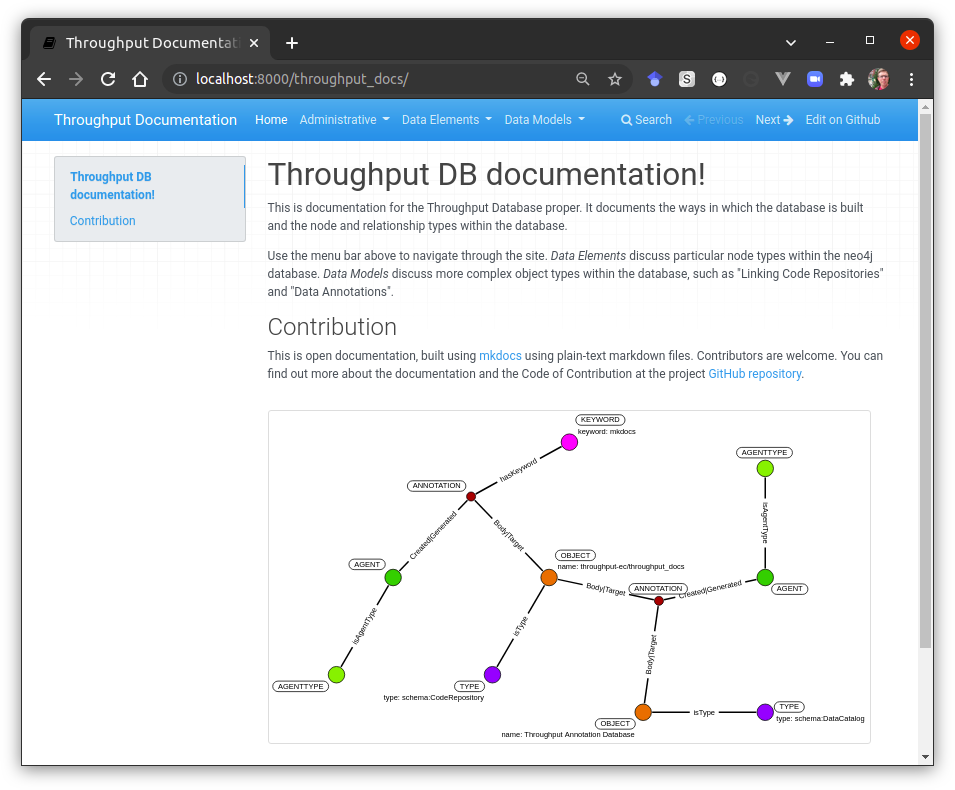

[](https://www.tidyverse.org/lifecycle/#experimental)
[](https://nsf.gov/awardsearch/showAward?AWD_ID=1928366)

# Throughput Documentation

Web documentation generated using Markdown documents together with the Python module [MkDocs](https://www.mkdocs.org/).  This documentation is intended to cover the main elements of the actual Throughput Database itself, including [installation instructions](https://throughput-ec.github.io/throughput_docs/admin/loading/) and [node types within the database](https://throughput-ec.github.io/throughput_docs/nodes/objects/).

There are also several [data models presented](https://throughput-ec.github.io/throughput_docs/models/data_models/) to help showcase uses for the database, and the ways in which queries may be structured.

## Contributors

This project is an open project, and contributions are welcome from any individual.  All contributors to this project are bound by a [code of conduct](CODE_OF_CONDUCT.md).  Please review and follow this code of conduct as part of your contribution.

* [Simon Goring](http://goring.org) [](https://orcid.org/0000-0002-2700-4605) - University of Wisconsin Madison
* [Michael Lenard](https://www.si.umich.edu/people/michael-lenard) [](https://orcid.org/0000-0003-0298-785X) - University of Michigan

### Tips for Contributing

Issues and bug reports are always welcome.  Code clean-up, and feature additions can be done either through pull requests to [project forks]() or branches.

All products of the Throughput Annotation Project are licensed under an [MIT License](LICENSE.md) unless otherwise noted.

## How to use this repository

Text files in this repository are parsed from Markdown using [MkDocs](https://www.mkdocs.org/), to generate a set of pages with navigation for use in displaying the Throughput documentation.

Mkdocs requires the use of Python.  Instructions are available online [to install Mkdocs](https://www.mkdocs.org/getting-started/#installation).  If Python 3.0+ and `pip` are both installed, then `Mkdocs` can be quickly installed using `pip install mkdocs`.

This repository is already set up as an Mkdocs project, so you can serve the pages locally using `mkdocs serve`, or render the whole site as a static webiste using `mkdocs build`.  The `serve` command allows you to monitor your changes as you go.  By default `mkdocs serve` serves the pages at `localhost:8000`.



### Workflow Overview

Markdown files are arranged in folders within the [`docs`}(docs/) folder.  Each folder represents a conceptual grouping of pages.  The navigation is defined in the file [mkdocs.yml](mkdocs.yml), in the `nav` property.

```bash
mkdocs build
```

Continuous integration for the repository is managed using [GitHub Actions](https://github.com/throughput-ec/throughput_docs/actions) with a module that [builds the pages using mkdocs](https://github.com/throughput-ec/throughput_docs/blob/prod/.github/workflows/ci.yml) under an Ubuntu build.  A failing build means that the current `prod` branch of the repository is not correctly set up to render a static Mkdocs site.

### System Requirements

This project was developed using Python 3.8.10 in a Linux evironment (Ubuntu 20.04.3 LTS).

### Data Requirements

This project is self-contained (except for the requirements described above).

### Key Outputs

This project generates a documentation website.  The `main` branch of the repository is live at [https://throughput-ec.github.com/throughput_docs](https://throughput-ec.github.com/throughput_docs).
