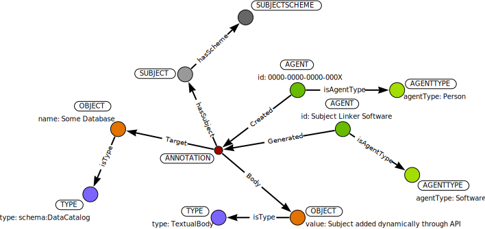

# KEYWORDs & SUBJECTs

## KEYWORDs

A `KEYWORD` can be associated with any `ANNOTATION`.  A common use would be to
help discover an `OBJECT` associated with a keyword such as *climate* or *cheese*.
Keywords could be associated with an `AGENT` or any other node type, but a `KEYWORD` is always connected through an `ANNOTATION`.


In this way, a `KEYWORD` may be associated with another `KEYWORD` through a synonymy which would be represented as indicated below.

### Matching Keywords

We often want to do a simple keyword search.  

```
MATCH (k:KEYWORD {keyword: $userkw})
MATCH (k)<-[:hasKeyword]-(a:ANNOTATION)
MATCH (a)-[:Target]->(ob:OBJECT)
MATCH (ob)-[:isType]->(ty:TYPE)
MATCH (a)-[:Body]->(obb:OBJECT)
RETURN properties(ob), ty.type, obb.value
```

This returns all objects (of any kind) associated with that keyword, the type of object (`ty.type`), and then the annotation text used to create the keyword link.  It may be that some keywords come from an authority (for example, the database or code repository has defined them directly), and others may have been added by a Throughput user.

Each `ANNOTATION` is tagged by the `AGENT` who `Created` the annotation, and the `AGENT` (most commonly a `SoftwareAgent`) who `Generated` the `ANNOTATION`.  This means we can also filter by `AGENT` or add the `AGENT` information to the query to get better information about the keyword relation.

### SYNONYMY

There are cases where assigned keywords may be too precise, or have spelling errors.  To account for this we can also use a synonymy.  Synonymy is indicated by the relationship `isSynonym` connecting two `KEYWORD` elements through an `ANNOTATION`.  This format allows us to have a `TextBody` `OBJECT` that contains information about why the synonymy was generated, and the agent who generated that synonymy.


#### Matching with Synonyms

In this case we can match by:

```
MATCH (k:KEYWORD {keyword: $userkw})
  OPTIONAL MATCH (syn:KEYWORD)<-[:isSynonym]-(:ANNOTATION)-[:isSynonym]->(k)
WITH COLLECT(syn) + COLLECT(k) AS kws
MATCH (kws)<-[:hasKeyword]-(a:ANNOTATION)
MATCH (a)-[:Target]->(ob:OBJECT)
MATCH (ob)-[:isType]->(ty:TYPE)
MATCH (a)-[:Body]->(obb:OBJECT)
RETURN properties(ob), ty.type, obb.value
```

This will look for all keywords and keyword synonyms, and then find all objects associated with them.  Again, we can filter by `TYPE`, `AGENT` or other elements to get a better subset of results.

## SUBJECTs

The `SUBJECT` is considered to be a more formal designation than a keyword.  The `SUBJECT` is associated with a `SUBJECTSCHEMA` that defines the set of potential subjects associated with an object, *via* an annotation with a `hasSubject` relationship.



An annotation for an `OBJECT` may have several `SUBJECT`s.  Currently, subjects from different schemes should be unique, even if they share the same name (for example, two scheme with a subject property '*History*'), since often the `SUBJECTSCHEME` also uses an alphanumeric identifier for subjects which is uniquely associated with that subject scheme.  For example, the Library of Congress Subject Headings service lists '*History*' as subject ID `sh85061212`, while the DFG lists '*History*' with subject ID `102`.
