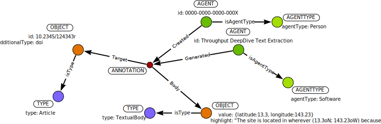

# New Annotations

New annotations can be added by users using an API.  We can add annotations in several ways.  A user can use the [Throughput Widget]() on a data repository website to annotate a particular data object, or dataset.  An individual may add an annotation to link a data repository to a particular code repository, or may create an annotation that adds additional information to a particular element within the Throughput annotation graph (for example, a description, keyword or subject to an object).

## Annotating a Dataset

### curl Request

```
curl -d '{dbid: 'r3d0000000', orcid: '0000-0000-0000-000X', additionalType: 'doi', id: '10.00000/00000000', body: 'This dataset is considered to be an outlier in Akenbata et al., 2021', token: 'XXXXXXX'}' -H 'Content-Type: application/json' https://throughputdb.com/api/widget
```

The dataset annotation API is a `POST` method that accepts the following parameters:
`dbid`, the unique database identifier; `orcid`, the user ORCID (for the user making the request), `additionalType`, this is a parameter that is implemented by the database on which the user is making the `POST` request, to identify at which level the annotation is being made, this is to account for potentially overlapping identifiers; `id`, the object identifier, associated with the `additionalType` and `dbid`; `body`, the text that us to be used to annotate the object, for example, *"This dataset is considered to be an outlier in Akenbata et al., 2021"*; `token`, the unique alphanumeric token that is associated with a particular database for use with the Annotation Widget.


In the figure above we can see that there are two `AGENT` elements, one is the Widget software that was used to post the annotation, and the particular instance of this widget is identified by the token passed in the `POST` request.  The second `AGENT` is the individual making the annotation, identified using their ORCID.  The `OBJECT` of `TYPE` `Dataset` is `Contain`ed within the `OBJECT` of `TYPE` `schema:DataCatalog`, identified by the `dbid` passed to the `POST` method.

The API call thus accounts for all elements needed to generate the graph for this particular annotation.

## DeepDive Annotations

Tools used to extract text from full text documents can store records in the Throughput graph.  This allows the document identifiers (e.g., DOIs) to then be linked to then be linked to the metadata extraction.  For example, a database could build metadata stubs for dataset entries based on prior extraction from full-text documents.  By then searching the graph for these annotations (using the DOI) some data entry can then be automated.



In this instance spatial information is extracted from a publication (`OBJECT` with `TYPE` `schema:Article`).  The annotation is placed in a `TextualBody`, however, **this may not be the most appropriate data model**.  We will continue this discussion as the project develops.
